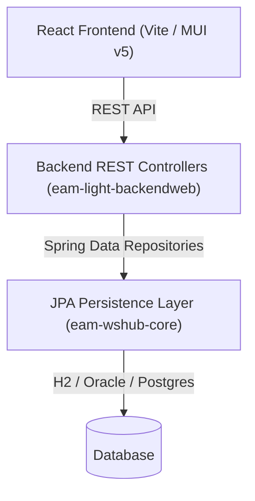

# EAM Light

EAM Light is a modern, lightweight web application providing an intuitive interface for Enterprise Asset Management (EAM). It combines a React frontend (`eam-light-frontend`) with a robust Java/Spring Boot backend (`eam-light-backend`) and a Spring Data JPA persistence layer (`eam-wshub-core`).

---

## 🏗 Architecture Overview



* **Frontend**: React 18, Material UI v5, Vite build engine.
* **Backend**: Java 17, Spring Data JPA repositories, REST APIs.
* **Database**: Embedded H2 for zero-dependency local development and testing, or Oracle / PostgreSQL for production deployment.

---

## 🚀 Building & Running the Application

### Method 1: Coupled Single-Server Mode (Recommended for Testing / Production)
Builds the React frontend, packages static assets directly into the backend JAR/WAR, and runs both on a **single port (`http://localhost:8080/`)**:

```bash
# 1. Build frontend and backend together
mvn clean compile -Pfrontend

# 2. Launch the unified Spring Boot server
mvn spring-boot:run -pl eam-light-backendweb
```

* **Frontend UI**: Open `http://localhost:8080/` in your browser.
* **REST API**: Accessible at `http://localhost:8080/rest/`.
* **H2 Demo Data**: `WO-1001`, `AST-1001`, `PART-1001`, and `admin` user are automatically seeded on startup.

---

### Method 2: Dual Terminal Hot-Reloading Mode (Recommended for Development)
Use this method when actively editing React components in `eam-light-frontend` so changes appear instantly in your browser via Vite Hot Module Replacement (HMR).

#### Terminal 1: Launch Backend Server
```bash
mvn spring-boot:run -pl eam-light-backendweb
```

#### Terminal 2: Launch Frontend Dev Server
```bash
cd eam-light-frontend
npm run dev
```

* **Frontend UI**: Open `http://localhost:3000/` in your browser.
* **Vite Proxy**: Automatically proxies all `/rest` API requests from `http://localhost:3000/rest` to `http://localhost:8080/rest` behind the scenes.

---

## 🧪 Testing & Quality Assurance

### 1. JPA Entity & H2 Schema Validation Tests
To run unit and persistence integration tests:

```bash
mvn test -Dtest=JpaConfigurationTest
```

### 2. Outside-In Selenium E2E Tests
EAM Light includes a full Selenium WebDriver test suite running in headless Chrome to verify all 17 React frontend routes:

```bash
# Run all E2E Selenium tests
mvn test -Dtest=*E2ETest

# Run specific domain tests
mvn test -Dtest=WorkOrderE2ETest
mvn test -Dtest=EquipmentE2ETest
mvn test -Dtest=PartE2ETest
```

---

## ⚙️ Configuration & Environment Variables

| Variable | Default Value | Description |
|---|---|---|
| `EAMLIGHT_AUTHENTICATION_MODE` | `STD` | Authentication mode (`STD`, `LOCAL`, `SSO`, `OPENID`) |
| `EAMLIGHT_DEFAULT_USER` | `admin` | Default user account for local mode |
| `EAMLIGHT_INFOR_TENANT` | `CERN` | Organization tenant identifier |
| `EAMLIGHT_INFOR_ORGANIZATION` | `CERN` | Default organization identifier |

---

## 📄 License
This software is published under the GNU General Public License v3.0 or later.